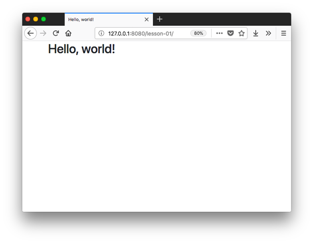
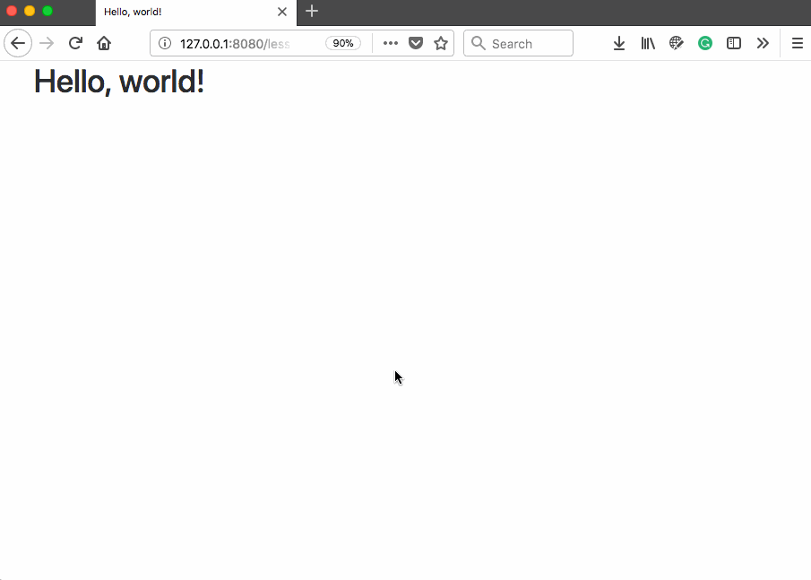

# Lesson 01: Designing a mobile-first responsive web portfolio <!-- omit in toc -->

The primary objective of this module is to guide you through creating a web portfolio for sharing all the fabulous maps you're creating in the New Maps Plus program. The lesson will introduce you to "responsive" design, which uses a "mobile-first" approach to ensure content displays optimally across browsers and devices of different sizes. We'll also explore the benefits and drawbacks of using an established CSS template or framework before moving on to employ Bootstrap for our purposes.

> Our mistake was the same as that of the creative person who places too much focus on How to create her work, while ignoring Why she is creating it. &ndash; Frank Chimero

## TOC <!-- omit in toc -->

- [Introduction](#introduction)
- [Web design: using templates and frameworks](#web-design-using-templates-and-frameworks)
  - [Advantages and disadvantages of writing your own web page](#advantages-and-disadvantages-of-writing-your-own-web-page)
  - [Choosing a template or framework](#choosing-a-template-or-framework)
- [Getting to know Bootstrap](#getting-to-know-bootstrap)
  - [Overview of Bootstrap Documentation](#overview-of-bootstrap-documentation)
  - [Using grids](#using-grids)
  - [Responsive design with media queries](#responsive-design-with-media-queries)
- [Building from an existing template](#building-from-an-existing-template)
  - [Accessing Bootstrap template example source code](#accessing-bootstrap-template-example-source-code)
- [Modifying a template's theme](#modifying-a-templates-theme)
  - [File/directory structure](#filedirectory-structure)
  - [1. Theme swapping the base CSS file](#1-theme-swapping-the-base-css-file)
  - [2. Adjusting a theme's styles with custom CSS](#2-adjusting-a-themes-styles-with-custom-css)
- [Conclusions: Toward Content](#conclusions-toward-content)
- [Resources](#resources)

## Introduction

This first lesson is entirely different than those that will follow throughout this term. Our principal goal in New Maps Plus is to make maps. Right? Of course, this involves many other pieces of knowledge and skills associated with Geographic Information Systems and data representing various geographies and landscapes. As likely became evident in MAP672, making maps today also demands highly technical and specialized knowledge of the web, how it works, and how to build web applications.

Rather than making a map, this lesson guides us through the process of making a web portfolio. To do so, we must answer many questions about the execution of the process:

* What web standards should we employ? 
* How do we select and implement an effective front-end framework? 
* Will it work solely on my desktop, or should we be able to use it just as well on our iPhones? 
* What colors or typefaces should we use to communicate our message? 
* What is the message and what form should this content take? 
  
These are all important questions involving the craft of web design, and by extension, web cartography.

In chapter one of his book, *The Shape of Design* (2012), Frank Chimero argues that we must consider questions of *Why* just as much as questions of *How*. He goes as far as to suggest the two are interlinked, and both are necessary for design to be successful. Before embarking on a set of tasks to build a portfolio site, you should reflect a bit on why you are making such a product (other than because it's the assignment ... but of course that's a reason too).

Prior to continuing through the lesson, read the [Introduction](http://shapeofdesignbook.com/chapters/00-introduction/) and [Chapter One](http://shapeofdesignbook.com/chapters/01-how-and-why/) of *The Shape of Design* (13 pages).

While the lesson guides you through much of the _How_ for completing the [assignment](assignment/), you should be thinking of a strategy for your web portfolio and more deeply about its purpose. Is it to showcase your maps to impress your boss and coworkers in hopes of a promotion? Is it to get a job or apply for a new one? Is it to share your cartographic interests and passion with a broader sphere of public and private viewers? The answers to these questions will help guide what form the content should take. It will help make your work original, despite borrowing heavily from the examples referenced and demonstrated below.

## Web design: using templates and frameworks

As mapmakers wearing the hat of web designers/developers, we face a choice on any given project: do we write our own custom HTML and CSS from the ground up (a.k.a. "rolling our own") or do we use an existing template or framework? There are advantages and drawbacks to each, and inevitably, we must have some command over the HTML and CSS to customize even a beautiful templated theme provided for us.

### Advantages and disadvantages of writing your own web page

When writing our own HTML and CSS, we can often produce leaner web pages with less code and fewer additional resources. Building our web page from scratch usually keeps the codebase simpler. Additionally, we don't need to learn the particular framework's way of doing things, such as using all the custom class names on elements, the sizing conventions built into the framework's core CSS rules, and the way a grid system is employed. All this takes time and adds a layer of abstraction between you and the HTML/CSS web standards that make open source design so amazing.

The drawback to rolling your own, of course, is that you must understand the web standards well enough to implement the desired layout and design. This becomes even more work when we apply responsive design to our process, which changes the layout of document elements based on the various device widths. Building an effective web page that works well across mobile, tablet, and desktop screens requires much more work. Finally, a good CSS template or framework may boast successful testing across many different web browsers, whereas you need to be much more rigorous in testing your build as you go. See [Bootstrap's support for browsers and devices](https://getbootstrap.com/docs/4.0/getting-started/browsers-devices/).

### Choosing a template or framework

There are many CSS frameworks out there from which to choose. And, with a [duckduckgo](https://duckduckgo.com/?q=best+css+framework+2017&t=hf&ia=web) search we can read reviews of the latest and greatest.

There is no perfect solution out there, and all still require at least a basic understanding of HTML and CSS.

* [Bootstrap](http://getbootstrap.com/)
* [HTML5 Boilerplate](https://html5boilerplate.com/)
* [Skeleton Boilerplate](http://getskeleton.com/)
* [Pure.css](https://purecss.io/)
* [Materialize](http://materializecss.com/)
* [Assembly.css](https://www.mapbox.com/assembly/documentation/)

Some more full-featured frameworks like Bootstrap offer more bells and whistles, such as default styling for nearly all HTML elements you may use, as well as JavaScript for dynamic events and user interaction. Others, such as the Skeleton Boilerplate, prioritize offering the developer a solid grid layout and minimal styling for other elements.

Most options are "mobile-first" (discussed more below), meaning that they prioritize usability on smaller mobile devices. We can contrast these with something like Materialize, which instead focuses on "material" interaction and UI components.

Choosing an appropriate framework, therefore, depends upon the needs of a particular project, as well as your familiarity with it. There are advantages to getting proficient at one solution, and once you master a framework such as Bootstrap, you may not want to take the time to learn another. However, being a web technologist in 2018 inevitably means constantly re-learning new things, so it's best not to get too comfortable with any one product.

You also want to consider the following when selecting one to go with:

* Is the framework in active development? You can often visit the GitHub repository to get a sense of when the last changes were committed.
* Is the framework's documentation thorough and clear with lots of examples?
* Is there a significant user base out there for seeking out answers to questions on Google Groups and StackOverflow?

## Getting to know Bootstrap

Bootstrap is what's known as a "front-end framework." This means that beyond the more simple CSS boilerplates, Bootstrap also includes JavaScript for fun UX/UI experiences such as dropdowns, image carousels, tooltips, and smooth scrolling behavior. Additionally, Bootstrap is dependent upon JQuery to work (whereas a simple CSS grid is not).

Begin by navigating your web browser to the [Bootstrap website](https://getbootstrap.com/). Fortunately, Bootstrap recently released version 4.4, so we can go ahead and start learning it now. Check out [their blog](https://blog.getbootstrap.com/) to see what new features Bootstrap is adding in their releases.

  
*Bootstrap's website.*

You should spend some more time reading through the (https://getbootstrap.com/)
the [documentation](https://getbootstrap.com/docs/4.0/getting-started/introduction/),
and investigating the [examples](https://getbootstrap.com/docs/4.0/examples/) after completing this section to get a better sense of the framework's possibilities.

We won't be building many "websites" in the course. Beyond the need for a nice portfolio, we're primarily interested in building single-page web map applications. These applications involve building up a "user interface" (UI), which we'll cover in greater detail in subsequent lessons. For now, however, scroll through the available [Components](https://getbootstrap.com/docs/4.0/components/alerts/) that Bootstrap supports and consider how these might be used within an interactive web map.

  
*Exploring Bootstrap's supported components.*

Following from [Chimero's first chapter](http://shapeofdesignbook.com/chapters/01-how-and-why/), the JavaScript libraries and CSS frameworks we'll be using (like Bootstrap) help us overcome a lot of the _How_ question of design, leaving us more room to focus on the _Why_ question. When it comes to interactive maps, we often want to give the user the ability to manipulate and engage with the application? But why? We do so because the user wants to re-express the data with a new variable or retrieve more specific information. To design these solutions we make use of a variety of UI solutions, most of which are reasonably standardized (such as drop-down menus, range sliders, or tooltips). As you experiment with Bootstrap this week, keep in mind how you as a user interact with maps, as well as how you anticipate users interacting with your maps. And make a mental note when a component or utility within Bootstrap may help you figure _how_ to achieve it.

### Overview of Bootstrap Documentation

To begin, open the **index.html** file found within the **lesson-01/** directory in your text editor. This is the new Stater template from [Bootstrap's Quick start documentation](https://getbootstrap.com/docs/4.0/getting-started/introduction/#starter-template):

```html
<!doctype html>
<html lang="en">
  <head>
    <!-- Required meta tags -->
    <meta charset="utf-8">
    <meta name="viewport" content="width=device-width, initial-scale=1, shrink-to-fit=no">

    <!-- Bootstrap CSS -->
    <link rel="stylesheet" href="https://stackpath.bootstrapcdn.com/bootstrap/4.4.1/css/bootstrap.min.css" integrity="sha384-Vkoo8x4CGsO3+Hhxv8T/Q5PaXtkKtu6ug5TOeNV6gBiFeWPGFN9MuhOf23Q9Ifjh" crossorigin="anonymous">

    <title>Hello, world!</title>
  </head>
  <body>
    <h1>Hello, world!</h1>

    <!-- Optional JavaScript -->
    <!-- jQuery first, then Popper.js, then Bootstrap JS -->
    <script src="https://code.jquery.com/jquery-3.4.1.slim.min.js" integrity="sha384-J6qa4849blE2+poT4WnyKhv5vZF5SrPo0iEjwBvKU7imGFAV0wwj1yYfoRSJoZ+n" crossorigin="anonymous"></script>
    <script src="https://cdn.jsdelivr.net/npm/popper.js@1.16.0/dist/umd/popper.min.js" integrity="sha384-Q6E9RHvbIyZFJoft+2mJbHaEWldlvI9IOYy5n3zV9zzTtmI3UksdQRVvoxMfooAo" crossorigin="anonymous"></script>
    <script src="https://stackpath.bootstrapcdn.com/bootstrap/4.4.1/js/bootstrap.min.js" integrity="sha384-wfSDF2E50Y2D1uUdj0O3uMBJnjuUD4Ih7YwaYd1iqfktj0Uod8GCExl3Og8ifwB6" crossorigin="anonymous"></script>
  </body>
</html>
```

Loading this page in your browser produces an unstyled document:

  
*The unstyled starter template.*

Not very exciting? Let's introduce how we use Bootstrap to apply CSS rules to our document.

Drawing first from the documentation on [Layout](https://getbootstrap.com/docs/4.0/layout/overview/), let's wrap our `<h1></h1>` heading in a container div. Modify your **index.html** document with the following HTML:

```html
<div class="container">
    <h1>Hello, world!</h1>
</div>
``` 

Note that we're applying a class of `container` to the div element. The Bootstrap CSS file we loaded into the document provides style rules for a class named `container`, and if we refresh our browser, we can see a modest adjustment to the layout.

  
*Adding a container class to a div element.*

We now want to open our web development tools to understand better how Bootstrap applies CSS rules to elements within this straightforward document (the only elements we currently have is the div tag and the h1 tag it's enclosing).

Open your web dev tools and click on the Inspector tab (called "Elements" in Chrome). You can use this to see the DOM structure of the document, as well as the CSS style rules applied to elements (in the right-side panel). Within the panel showing the CSS styles at right, you can also dynamically adjust style rules, modifying values or checking/unchecking rules. These aren't changing the files producing the CSS, but only how the browser is currently rendering the document.

  
*Inspecting the page with the web developer tools.*

Now modify your HTML further, adding two additional class names to our div element:

```html
<div class="container mt-5 p-4">
    <h1>Hello, world!</h1>
</div>
```

These two classes are specifying that the div element should have a margin on the top with a value of `5` (`mt-5`) and padding within it of a value of `4` (`p-4`). Saving the changes and refreshing the page shows the additional adjustments to the layout:

  
*Class rules affecting the layout of elements.*

We can add two additional classes to see better what's going on, one to give the div element a background color and the other to change the font color of the enclosed text:

```html
<div class="container mt-5 p-4 bg-dark text-white">
    <h1>Hello, world!</h1>
</div>
```

We can now visually see how the margin and padding have affected the layout of the elements. Within the panel at the right, we see the specific CSS style rules Bootstrap applies to these elements.

  
*Inspecting the class rules applied with Bootstrap's class names*

It is critical to note the inclusion of `!important` within some of the rule properties. This addition to a rule means that it cannot be over-written by a rule declaration applied later on within the natural cascading of rules (such as in our custom CSS stylesheet). Though the use of this rule within your own stylesheets is considered bad practice and should be avoided, Bootstrap applies `!important` to some rules so that they remain consistent no matter what (for better or worse).

  
*Noting the !important rule included in some class definitions.*

Remember Bootstrap's use of the `!important` rule when you're tweaking the style of a design or theme with your custom CSS rules and the changes appear not to take effect.

Let's answer two questions before moving on:

1. How do we know where to find these class names to apply to elements?
2. What are those number values we used with the margin and padding class names?

Getting to know a framework's documentation well is essential to successful development using a framework.

To answer our margin and padding class names question we can search Bootstrap's documentation by those names. This will help us identify which sections hold our desired information.

  
*Searching Bootstrap's documentation.*

We see that Bootstrap's documentation briefly describes how to use margin and padding under a section called [Utilities for layout](https://getbootstrap.com/docs/4.0/layout/utilities-for-layout/#margin-and-padding). This subsection links us to another important piece of the documentation under [spacing and utilities](https://getbootstrap.com/docs/4.0/utilities/spacing/), which better explains the notation for setting margin and padding in the available directions (top, right, bottom, left, etc.). It also describes the set of pre-specified sizes (0 - 5), which correspond to a given value specified in rem units (you can inspect these again within the web developer toolbar's CSS rules).

We can likewise search through the documentation to find the appropriate class names for applying background and text colors.

  
*Searching the documentation for background colors.*

We can see from the documentation that the default Bootstrap CSS theme designates colors for a set of specific class names: `primary`, `secondary`, `success`, `danger`, `warning`, `info`, `light`, `dark`, `muted`, and `white`. While there are other characters available within the theme (which we'll explore in a bit), Bootstrap establishes these for consistency across a website or application. 

Again, Bootstrap's core CSS rules help us determine _how_ we achieve consistency. But prompted by Chimero's writing, we can also consider _why_. Consistency in design is a principle these rules help enforce. If you wish to provide warning affordances for your user, you'd want to use the same color every time for warnings. Beyond this, you wouldn't want to use the same color for primary headings as warnings and links. Doing so may confuse the user as to the meanings these colors convey. Producing an experience with the web application that is learnable and predictable will empower the user and make the product more of a pleasure to use. This is why we care about consistency.

Try modifying the `bg-dark` rule we've applied to the div element. For instance, we can apply a `bg-primary` class name:

```html
<div class="container mt-5 p-4 bg-primary text-white">
    <h1>Hello, world!</h1>
</div>
```

This will apply the color associated with the `bg-primary` class defined within the stylesheet of Bootstrap's default theme (the blue hue represented by the hexadecimal value of `007bff`):

  
*A `bg-primary` class applied to a div.*

Bootstrap provides a set of pre-established colors within the CSS. Before we dig into Bootstrap's CSS, let's quickly introduce how grids are applied to design within such a framework.

### Using grids

Within Bootstrap's documentation, the section on the [Grid system](https://getbootstrap.com/docs/4.0/layout/grid/) provides the critical information for using grids within the framework. The [example page of basic grid layout examples](https://getbootstrap.com/docs/4.0/examples/grid/) is also helpful (hint: use your developer tools on this page to see what class names are applied to what elements).

The key to using the grid system for structuring your document's layout is to enclose div elements with class names of `col` within a parent div using a class name of `row`.

Continue to modify the code within your **index.html** file, adding a basic example drawn and modified from the documentation on the grid system:

```html
<div class="container mt-5 p-4 bg-primary text-white">
  <h1>Hello, world!</h1>
  <!-- row -->
  <div class="row mt-5 py-4 bg-secondary">
      <!-- col -->
      <div class="col py-3 bg-light text-dark">
          One of three columns
      </div>
      <!-- col -->
      <div class="col py-3 bg-dark text-light">
          One of three columns
      </div>
      <!-- col -->
      <div class="col py-3 bg-info">
          One of three columns
      </div>
  </div>
</div>
```

We've added a `<div class="row"></div>` and within it placed three `<div class="col"></div>` elements. This is what creates the grid system in Bootstrap (composed of 12 columns).

Aforementioned should produce a page that looks like this:

  
*A three-column grid within Bootstrap.*

Of course, we've also included some other class names on those div elements for styling. Namely:

* `mt-5` to give the row element a margin of 5 on top
* `py-4` to give the row element a padding of 4 on the top and bottom (the y-axis)
* `bg-secondary` to give the row element a color value (gray, in this case)
* `py-3` on each of the col elements to give a padding of 3 on the top and bottom
* `bg-light`, `bg-dark`, and `bg-info` on the three col elements to give them different color backgrounds, and
* a `text-light` class on the middle column to make the text visible

It's entirely okay if all the class names seem confusing at the moment. It takes some time to get familiar with the particular framework, what class names are available, and how to use them. We'll continue to learn these as we introduce some more ways to engage with and learn about how to style (or "theme") a Bootstrap design.

But first, let's cover how we make this page responsive to various devices our user may be using to view our web page. We can see that we've built a "flexible grid" and the width of the div containers and the columns adjust when we resize the page. The best way to demonstrate and test this process is to use the web developer tools allowing us to view [responsive design mode](https://developer.mozilla.org/en-US/docs/Tools/Responsive_Design_Mode) (Firefox) or [Device mode](https://developers.google.com/web/tools/chrome-devtools/device-mode/emulate-mobile-viewports) (Chrome).

With this mode enabled, we can see how the widths of elements are not fixed but are flexible.

  
*A fluid but not responsive grid solution.*

Ideally, the three columns would adapt to the shrinking width of their container by stacking atop one another. Let's now learn how Boostrap's media queries help us achieve a responsive design.

### Responsive design with media queries

A critical aspect to understand about web design in 2018 &ndash; and the use of frameworks such as Bootstrap &ndash; is what's known as "responsive web design," which was introduced in a [seminal article written by Ethan Marcotte in 2010 titled "Responsive Web Design"](https://alistapart.com/article/responsive-web-design). Within this article, Ethan outlines what would become the dominant approach to building web pages today: using flexible grids for layout, flexible images/videos for adaptive content, and CSS media queries for determining the width of a browser or device.

[Media queries](https://developer.mozilla.org/en-US/docs/Web/CSS/Media_Queries/Using_media_queries) work by setting particular "breakpoints" of the antipated device's width and applying particular style rules within those break points. The [responsive breakpoints](https://getbootstrap.com/docs/4.0/layout/overview/#responsive-breakpoints) within Bootstrap's default theme are 576px, 768px, 992px, and 1200px.

  
*The default breakpoints of Bootstrap's theme.*

Bootstrap's CSS stylesheet has specified rules within each of these breakpoints and provided ways for us to apply these rules to various elements (see the documentation under [Grid options](https://getbootstrap.com/docs/4.0/layout/grid/#grid-options)). These include "prefixes" we can apply to HTML elements within our layout. For example, modify our existing code by appending a `-sm` to each of the columns:

```html
    <div class="col-sm py-3 bg-light text-dark">
        One of three columns
    </div>
    <div class="col-sm py-3 bg-dark text-light">
        One of three columns
    </div>
    <div class="col-sm py-3 bg-info">
        One of three columns
    </div>
```

Now, when we resize our browser, we can see how the column class is applied only to sizes above the small threshold (540px). Anything smaller than this and the `col` class isn't applied, and those division elements default back to being a block-level element (extending across the width of their container).

  
*A fluid and responsive grid solution.*

If we dug into [Bootstrap's CSS file](https://github.com/twbs/bootstrap/blob/v4-dev/dist/css/bootstrap.css), we'd see the rules that make this happen:

```css
@media (min-width: 576px) {
  .col-sm {
    -ms-flex-preferred-size: 0;
    flex-basis: 0;
    -webkit-box-flex: 1;
    -ms-flex-positive: 1;
    flex-grow: 1;
    max-width: 100%;
  }
}
```

When the device has a width wider than 576px (a little counter-intuitive, yes), then the rules within the `.col-sm { }` CSS rule are applied. Here is the lovely part: do you know to write `flex-basis: 0;` and `flex-grow: 1;`? Does your instructor? Doubtfully so! The talented designers at Bootstrap understand these rules much better than we do, so we can rest on their labor and simply apply the class name `col-sm` to a division element. 

However, even with a polished framework like Bootstrap, responsive design is both challenging and time-consuming. While Bootstrap's classes and prefixes make it easier for us, you still need to make many decisions about how to display the content within each breakpoint.

A recommended strategy is to take a "mobile-first" approach, which Bootstrap's design promotes. The idea is that you start with the smallest anticipated viewport and write your CSS rules for that. As a device get wider, you can target its width with media queries and add/remove/modify CSS rules to fit the available space.

The preceding is just a taste of frameworks and Bootstrap, and we could spend an entire course on responsive web design. But for now, let's continue using Bootstrap's resources to understand better the development process (and work toward building our portfolio!).

## Building from an existing template

If wading through Bootstrap's documentation and building up a page from the ground up seems daunting, you're correct. To do so quickly requires a lot of experience with the web standards and using web frameworks. However, you have the rest of your life, so why not start now?

An alternative when getting started is to use an existing template to help structure your document and apply class names to the elements. Experimenting with existing templates and examples is a terrific way to learn. Navigate your browser to the [Bootstrap examples](https://getbootstrap.com/docs/4.0/examples/). Scroll through these examples to get a sense of what templates are available. 

Note: Bootstrap's official examples are a great place to start. Bootstrap also offers more fully-designed themes at a premium price. Below, we'll explore the difference between templates and themes and point you in the direction of some free themes with which to play.

  
*Bootstrap's official examples.*

Click on the first one, a [basic starter template](https://getbootstrap.com/docs/4.0/examples/starter-template/) and switch into your responsive/device mode. We can see some menu items and a search form across the top. When adjusting the width of the viewport, we can see how the page "responds" by collapsing the menu.

  
*A responsive nav bar in Bootstrap's starter example.*

We can also use our web developer tools to study the template's HTML and CSS.

  
*Inspecting the HTML and CSS of an example with the development tools.*

As you become a more seasoned web (map) designer, it becomes even more essential to learn by example. Studying and understanding quality web pages like those offered by Bootstrap is a great way to expand your learning and gain knowledge of best practices.

But when starting with a framework like Bootstrap, we're also eager to merely snatch some working HTML/CSS and plop it into our pages and projects! How do we do this?

### Accessing Bootstrap template example source code

At the top of the examples page, choose to [Download the Bootstrap source code](https://github.com/twbs/bootstrap/releases/download/v4.0.0/bootstrap-4.0.0-dist.zip) and save the zip file to your computer. Download the file and save it outside of your working NMP repository for module 01. We're just going to be examining the source code with our code editors (no need to include in the repo for submission).

Unzip the file, which contains the GitHub repository for Bootstrap (also available here https://github.com/twbs/bootstrap). There are many files and folders within the unzipped directory, many of which will be unfamiliar and involve build processes for the project from the source code. That is a bit beyond this course (though we cover it in MAP675!), but for now we want to draw our attention to **examples** directory within this repository.

Navigate into the **site/docs/4.4** directory to find a directory named **examples/**, which contains the HTML and file for custom CSS for all the examples we see on the examples page. We will need to insert this HTML into our **lesson/index.html** and copy the CSS file, too.

  
*Finding the "examples" code in the Bootstrap repository.*

Open the entire **bootstrap-4.4.1-dist/** directory in a text editor (but again, keep this separate in your text editor from your module-01 code and don't get the various **index.html** files confused). Within our text editor, find the **starter-template/** directory and open the two files it comprises with your code editor: the usual **index.html** file and a file named **starter-template.css**.

You'll find that the starter template HTML doesn't contain a `<head></head>` element nor any links to JS files. This HTML represents what goes inside the `<body></body>` tag in our **lesson/index.html**, with some modifications.

```html
<nav class="navbar navbar-expand-md navbar-dark bg-dark fixed-top">
  <a class="navbar-brand" href="#">Navbar</a>
  <button class="navbar-toggler" type="button" data-toggle="collapse" data-target="#navbarsExampleDefault" aria-controls="navbarsExampleDefault" aria-expanded="false" aria-label="Toggle navigation">
    <span class="navbar-toggler-icon"></span>
  </button>

  <div class="collapse navbar-collapse" id="navbarsExampleDefault">
    <ul class="navbar-nav mr-auto">
      <li class="nav-item active">
        <a class="nav-link" href="#">Home <span class="sr-only">(current)</span></a>
      </li>
      <li class="nav-item">
        <a class="nav-link" href="#">Link</a>
      </li>
      <li class="nav-item">
        <a class="nav-link disabled" href="#" tabindex="-1" aria-disabled="true">Disabled</a>
      </li>
      <li class="nav-item dropdown">
        <a class="nav-link dropdown-toggle" href="#" id="dropdown01" data-toggle="dropdown" aria-haspopup="true" aria-expanded="false">Dropdown</a>
        <div class="dropdown-menu" aria-labelledby="dropdown01">
          <a class="dropdown-item" href="#">Action</a>
          <a class="dropdown-item" href="#">Another action</a>
          <a class="dropdown-item" href="#">Something else here</a>
        </div>
      </li>
    </ul>
    <form class="form-inline my-2 my-lg-0">
      <input class="form-control mr-sm-2" type="text" placeholder="Search" aria-label="Search">
      <button class="btn btn-secondary my-2 my-sm-0" type="submit">Search</button>
    </form>
  </div>
</nav>

<main role="main" class="container">

  <div class="starter-template">
    <h1>Bootstrap starter template</h1>
    <p class="lead">Use this document as a way to quickly start any new project.<br> All you get is this text and a mostly barebones HTML document.</p>
  </div>

</main><!-- /.container -->
```

This document is meant to be used with templating software to create documents on-the-fly. However, we can build our page and strengthen our knowledge in assembling a properly-formatted HTML document. 

Insert the above code after the `<body>` tag in the **lesson/index.html**. Delete the `h1` element and modify the `title` tag to reflect the new document. Create, or copy, the **starter-template.css**, add it to you **lesson/** folder and add the resource to **lesson/index.html** `head` section after the Bootstrap CSS. Finally, add a `<script></script>` tag and a `console.log()` function to verify it works. Your **lesson/index.html** should look similar to:

```html
<!doctype html>
<html lang="en">
  <head>
    <!-- Required meta tags -->
    <meta charset="utf-8">
    <meta name="viewport" content="width=device-width, initial-scale=1, shrink-to-fit=no">

    <!-- Bootstrap CSS -->
    <link rel="stylesheet" href="https://stackpath.bootstrapcdn.com/bootstrap/4.4.1/css/bootstrap.min.css" integrity="sha384-Vkoo8x4CGsO3+Hhxv8T/Q5PaXtkKtu6ug5TOeNV6gBiFeWPGFN9MuhOf23Q9Ifjh" crossorigin="anonymous">

    <!-- My custom CSS -->
    <link rel="stylesheet" href="starter-template.css">


    <title>Hello, world! My first starter template!!
    </title>
  </head>
  <body>
    <nav class="navbar navbar-expand-md navbar-dark bg-dark fixed-top">
      <a class="navbar-brand" href="#">Navbar</a>
      <button class="navbar-toggler" type="button" data-toggle="collapse" data-target="#navbarsExampleDefault" aria-controls="navbarsExampleDefault" aria-expanded="false" aria-label="Toggle navigation">
        <span class="navbar-toggler-icon"></span>
      </button>
    
      <div class="collapse navbar-collapse" id="navbarsExampleDefault">
        <ul class="navbar-nav mr-auto">
          <li class="nav-item active">
            <a class="nav-link" href="#">Home <span class="sr-only">(current)</span></a>
          </li>
          <li class="nav-item">
            <a class="nav-link" href="#">Link</a>
          </li>
          <li class="nav-item">
            <a class="nav-link disabled" href="#" tabindex="-1" aria-disabled="true">Disabled</a>
          </li>
          <li class="nav-item dropdown">
            <a class="nav-link dropdown-toggle" href="#" id="dropdown01" data-toggle="dropdown" aria-haspopup="true" aria-expanded="false">Dropdown</a>
            <div class="dropdown-menu" aria-labelledby="dropdown01">
              <a class="dropdown-item" href="#">Action</a>
              <a class="dropdown-item" href="#">Another action</a>
              <a class="dropdown-item" href="#">Something else here</a>
            </div>
          </li>
        </ul>
        <form class="form-inline my-2 my-lg-0">
          <input class="form-control mr-sm-2" type="text" placeholder="Search" aria-label="Search">
          <button class="btn btn-secondary my-2 my-sm-0" type="submit">Search</button>
        </form>
      </div>
    </nav>
    
    <main role="main" class="container">
    
      <div class="starter-template">
        <h1>Bootstrap starter template</h1>
        <p class="lead">Use this document as a way to quickly start any new project.<br> All you get is this text and a mostly barebones HTML document.</p>
      </div>
    
    </main>

    <!-- Optional JavaScript -->
    <!-- jQuery first, then Popper.js, then Bootstrap JS -->
    <script src="https://code.jquery.com/jquery-3.4.1.slim.min.js" integrity="sha384-J6qa4849blE2+poT4WnyKhv5vZF5SrPo0iEjwBvKU7imGFAV0wwj1yYfoRSJoZ+n" crossorigin="anonymous"></script>
    <script src="https://cdn.jsdelivr.net/npm/popper.js@1.16.0/dist/umd/popper.min.js" integrity="sha384-Q6E9RHvbIyZFJoft+2mJbHaEWldlvI9IOYy5n3zV9zzTtmI3UksdQRVvoxMfooAo" crossorigin="anonymous"></script>
    <script src="https://stackpath.bootstrapcdn.com/bootstrap/4.4.1/js/bootstrap.min.js" integrity="sha384-wfSDF2E50Y2D1uUdj0O3uMBJnjuUD4Ih7YwaYd1iqfktj0Uod8GCExl3Og8ifwB6" crossorigin="anonymous"></script>
    <script>
        console.log("Bring it on!")
    </script>
    </body>
</html>
```


Render the example in your browser using a local host/live-server. e.g., `http://127.0.0.1:5500/lesson/` and examine the output. Does it work? Yea!

    
*Successful starter template in your lesson repository*

Begin to examine the code contained within the starter template. It's a best practice to load CSS stylesheets within the `<head></head>` tags at the top of the document, and Bootstrap follows suit. 

Next, study the HTML elements written within the `<body></body>` tags. This is where we write the content of our web page. This particular template is mostly just the navigation bar at the top. But we can note the class names applied to all the elements. All of these class names have rules specified within the **bootstrap.min.css**, except one. The class name `starter-template` is written within the second stylesheet loaded by the document, the **starter-template.css** file. The key insight here is that we first load the Bootstrap CSS but can then write our own custom CSS definitions to modify the layout and design further.


Finally, we note that Bootstrap loads the JavaScript at the bottom of the page from a remote CDN, again adhering to best practices. The document loads three JavaScript files:

1. JQuery's minified slim version [jQuery](https://jquery.com/)
2. A minified JavaScript library named [Popper.js](https://popper.js.org/), which provides for some flashy tooltip and mouseover behavior (`popper.min.js`), and
3. Bootstrap's minified JavaScript file (`bootstrap.min.js`)


Finally, add your custom JS after the Bootstrap link. You might have noticed the pattern that we add our custom CSS and JS after loading the resources needed by Bootstrap. 

This example shows how to build a page from scratch, but you won't be editing or assembling files from Bootstrap's source code. Rather, part of your task as a student of web design and development is to puzzle through which pieces of a template you can grab and stick into your own page, and how to adjust the paths looking to load CSS, JavaScript, and font/icon/image resources so that the page loads correctly. It's a messy process at times but a great learning exercise, and you can eventually get your page working as you intend.

However, because we don't have ten weeks to master responsive web design and Bootstrap's framework (we have maps to make!), I've provided a template to keep us moving.

## Modifying a template's theme

Save any changes to your **index.html** file created in the previous sections and close that file within your code editor. Next, open the **lesson-template** included with this repository. Render the directory's **index.html** file in your browser using a local server. You should see the following page:

  
*A basic starter template for a New Maps Plus portfolio.*

This is a basic and relatively unstyled one-page portfolio template (at least regarding typography and colors). It is built using Bootstrap and a combination of starter templates provided by another good resource: [Start Bootstrap](https://startbootstrap.com/), which offers free Bootstrap themes and templates.

Take a moment now to explore some of the template and themes offered by Start Bootstrap. Also note that one of the theme categories is "Unstyled Starter Templates," which I drew from to produce the template provided. These are great for getting the HTML layout with appropriate Bootstrap classes going, without having to write them all yourself. Yet they don't offer the fully-designed theme that some of the others do, thus allowing you to craft your own design.

  
**Figure 24.** Start Bootstrap's unstyled templates.

You can preview or download the source code to these templates to incorporate it into your own project. Like most web projects these days, you can also find all these examples on [the project's GitHub repo](https://github.com/BlackrockDigital/startbootstrap).

Beyond providing a basic layout for three sections (a header/splash section, a section for showcasing projects, and an "about" section), the template I've provided also contains class definitions allowing for a responsive, mobile-friendly user experience. Again, you can switch your browser to responsive/device mode to see how the layout collapses and responds at various widths. It is also using some JavaScript to scroll smoothly between sections, enhancing the user experience.

  
*The responsive nature of the starter template.*

This template isn't intended to be a finished product, but rather a jumping off place for experimenting with your own portfolio page. Before you're set free to do so, let's run through a few important aspects of this template.

### File/directory structure

Carefully examine the file/directory structure. You'll notice that along with the **index.html** file, there are four directories: **css/**, **images/**, **js/**, and **vendor/**. There are many ways to organize the file/directory structure of a website or web application, but this is a fairly common way. 

Note that we're separating our CSS and JS resources from the HTML document, which makes writing within and maintaining the HTML document much more manageable.

  
*The file/directory structure of the starter template.*

Furthermore, separating the "vendors" or external libraries from our own custom JS and CSS makes it easier to version libraries we're using and update them. 

Examine the files within each directory. Under **vendor/bootstrap/** you can see Bootstrap's **css/** and **js/** directories from the **dist/** directory we acknowledged earlier. I've simply copied these directories from the GitHub repository into this project.

  
*Expanded file/directory structure of the starter template.*

The important part is, if you open the **index.html** file in your text editor, you'll see that the document uses relative paths to load these files at runtime.

```html
<!-- Bootstrap CSS -->
<link href="vendor/bootstrap/css/bootstrap.min.css" rel="stylesheet">
<!-- JQuery JavaScript -->
<script src="vendor/jquery/jquery.min.js"></script>
```

The template also includes support for [Font Awesome](http://fontawesome.io/), which loads a stylesheet for specialized fonts and icons (which i use for the icons in the "Contact" section:

```html
<link href="https://maxcdn.bootstrapcdn.com/font-awesome/4.7.0/css/font-awesome.min.css" rel="stylesheet" integrity="sha384-wvfXpqpZZVQGK6TAh5PVlGOfQNHSoD2xbE+QkPxCAFlNEevoEH3Sl0sibVcOQVnN" crossorigin="anonymous">
```

Beyond loading JQuery, which Bootstrap requires, the page also loads an additional JQuery plugin to help with the smooth easing of the scroll transitions:

```html
<!-- JavaScript Plugin -->
<script src="vendor/jquery-easing/jquery.easing.min.js"></script>
```

The document is broken into different sections using `<section>` tags. Beyond using a few semantically appropriate tags such as `<h1>`, `<p>`, `<a>`, and `<dl>` (definition list), the page is mostly build using generic `<div>` tags with Bootstrap's class names applied to them.

Before moving on, compare the **lesson-template/** folder to the **lesson/index.html**. The template folder has the required Bootstrap resources saved locally. The **lesson/index.html** uses a CDN to load Bootstrap's required resources remotely. This is another common way to organize a web project and many templates use CDNs. 

The advantage of using local files, e.g., in "vendors" folder, is being able to work offline and "locking" your site to specific resource versions. Working with a CDN can provide performance increases, especially if your resource is commonly used, like jQuery. So, it's essential to recognize how your assets/resources are loaded in your project.

Let's now work on modifying the theme. But first, consider the distinction between a template and a theme. Above, we looked at Bootstrap's official examples, which are templates. These are minimally-styled in terms of typography and color but provide a basic layout structure. A theme, on the other hand, involves a much more carefully designed set of style rules which give the page a unique sense of expression. Even if Start Bootstrap's [Clean Blog](https://blackrockdigital.github.io/startbootstrap-clean-blog/) is minimal in its design, it's much more of a designed theme than the template I've provided for you.


Let's now consider a fun approach for developing a theme from a template.

### 1. Theme swapping the base CSS file

[Bootswatch](https://bootswatch.com/) is a fun site offering several free Bootstrap themes you can use for free.

  
*Bootstrap's free themes.*

Clicking **Preview** on the **Darkly** theme allows you to see how the theme styles a variety of HTML elements that the default, or core, Bootstrap theme does.

  
*A preview of the styles applied using the Darkly Bootstrap theme.*

Return to Bootstrap's homepage and click "Download" on the "Darkly" theme. Curiously, it doesn't download any files for us. Rather, we're looking at a CSS file named **bootstrap.min.css**. 

  
*The CSS of the Darkly Bootstrap theme.*

Copy all the CSS to your clipboard. Then, within your text editor open the **vendor/bootstrap/css/bootstrap.min.css**. Delete all the CSS within that file and paste in the CSS from the Darkly theme. Save the changes to the bootstrap.min.css file and refresh your browser. Wallah! Like magic, the theme has changed, and the page has a dramatically different look and feel, primarily through modifying the typography and colors.

  
*Swapping the default Bootstrap theme with the Darkly theme.*

This isn't to say that the layout and design don't need to be tweaked and more custom CSS written. For instance, if we're using a `bg-dark` class on a section we may need to remove that class or change it to `bg-light`. Good design is never easy, and it's the small iterative tweaks such as adjusting margin and padding that make the final project feel whole and complete. Still, the themes at Bootswatch can inspire our more customized design of a page or application.

Undo those changes to the **bootstrap.min.css** file within your code editor (or copy the original CSS from the GitHub repo or Bootstrap's source code) to return the theme to the original so we can further explore our process for customizing the theme.

### 2. Adjusting a theme's styles with custom CSS

The template provided includes a CSS stylestyle, **css/styles.css**, which loads after Bootstrap's stylesheet. This means that we can augment and/or override the rules written within Bootstrap's stylesheet (provided the rule in Boostrap doesn't include the `!important` rule).

For instance, let's say we wish to use the popular [Google web font Lato](https://fonts.google.com/specimen/Lato?selection.family=Lato). We can request that resource within our web document (place this directly before the request for the **style.css** file):

```html
<link href="https://fonts.googleapis.com/css?family=Lato" rel="stylesheet">
```

And then within the **style.css** file we can add a rule (at the top of the existing rules, because it's the top-level `<body>` tag):

```css
body {
  font-family: Lato;
}
```

Saving these changes and refreshing the browser will reveal that the text is now rendered using the Lato font.

  
*Applying the Google font Lato to the starter template's theme.*

What if we wanted to style the `<a>` tags using an orange color, rather than the default blue? We can write another rule to do this:

```css
a {
  color: orange;
}
```

The result is that all a tags are now orange:

  
**Figure 33.** Applying a class rule to anchors in the starter template's theme.

What if we wanted to change the background color of that `<header>` element? We noted earlier that applying the `bg-primary` or `bg-secondary` classes to it gave it a color, but the CSS rule included the `!important` rule, thus making it difficult to override. A simple solution would be to remove the class entire and either write your own class or simply select the `<header>` with CSS (since there is only one) and give it a color.

After removing the `bg-secondary` class from the `<header>` element in the HTML, we can add an additional rule to the already existing header selection in the CSS file:

```css
header {
  padding: 154px 0 100px;
  background-color: #448ee4;
}
```

  
*Applying a background color rule to the header element.*

In this way, we can begin to customize the styles of our bootstrap theme without simply swapping in an existing theme.

## Conclusions: Toward Content

The purpose of a web portfolio, however, isn't merely to display a working website with Lorem ipsum content. This lesson walked us through the basics of *how* to use Bootstrap and to develop/modify an existing CSS theme. You can use any theme/style you want, but ask *why* you make design choices that you do. In order for the form to work, it needs a purpose. Your task within the [assignment](assignment/) is to complete this design process by populating a working portfolio page with content.

## Resources

* [Shape of Design](http://shapeofdesignbook.com)
* [Bootstrap](https://getbootstrap.com/)
* [Start Bootstrap](https://startbootstrap.com/)
* [Bootswatch](https://bootswatch.com/)
* [Font Awesome](https://bootswatch.com/)
* [Font Awesome Bootstrap Cheetsheet](https://fontawesome.bootstrapcheatsheets.com/)

