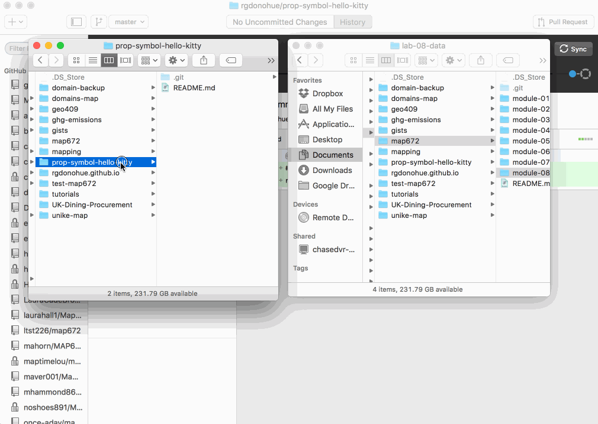
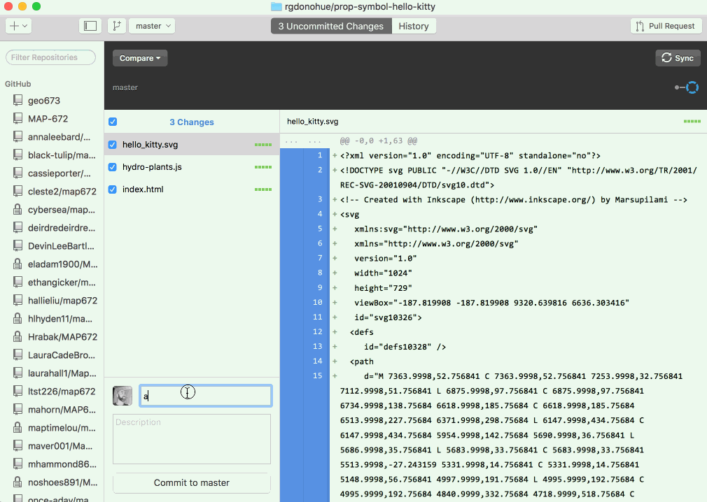

# Assignment 01: Designing a responsive web portfolio

<!-- TOC -->

- [Assignment 01: Designing a responsive web portfolio](#assignment-01-designing-a-responsive-web-portfolio)
    - [Part I: How and Why](#part-i-how-and-why)
    - [Part II: Introduce yourself on Canvas (2 pt)](#part-ii-introduce-yourself-on-canvas-2-pt)
    - [Part III: Make a personal web portfolio (8 pts)](#part-iii-make-a-personal-web-portfolio-8-pts)
        - [Requirements for the deliverable:](#requirements-for-the-deliverable)
        - [Recommendations for completing the portfolio](#recommendations-for-completing-the-portfolio)
            - [Text](#text)
            - [Hyperlinks](#hyperlinks)
            - [Images](#images)
        - [Hosting your portfolio on GitHub Pages](#hosting-your-portfolio-on-github-pages)
        - [Hosting web maps from previous courses](#hosting-web-maps-from-previous-courses)
    - [Addendum: Creating new repos for lab projects](#addendum-creating-new-repos-for-lab-projects)

<!-- /TOC -->

## Part I: How and Why 

Read the first chapter of *The Shape of Design*, ["How and Why"](https://shapeofdesignbook.com/chapters/01-how-and-why/) and reflect on why you make maps.

## Part II: Introduce yourself on Canvas (2 pt)

Find the discussion forum called *Introductions* in our first module on Canvas. Using the Part I reading, share a short statement of what inspires you and your design choices. Paste the public URL to your web portfolio you make in Part III (you can add the link to your forum post after you write your statement).


## Part III: Make a personal web portfolio (8 pts) 

You should build your portfolio within the **lesson-01/** directory of your **map673-module-01-_username_/** repository (and commit and push changes as you work). This way your instructor can easily help you diagnose problems along the way.

However, the final product will be copied over to a new repository you'll create on your personal GitHub account (see the [instructions below](#hosting-your-portfolio-on-github-pages)).

### Requirements for the deliverable:

* Portfolio should be hosted on GitHub and rendered through GitHub Pages
* Portfolio must showcase at least four mapping projects from NMP courses. These may include static maps, web maps hosted on GitHub Pages or another hosting service, and/or links to maps hosted on a service such as CARTO.
* Each project should be displayed using a smaller image, some descriptive text about the map, and a brief summary of the tools and processes used to create the map. You may wish to include links to the data sources of the maps as well, depending on the map and if it doesn't make that clear.
* Portfolio should include a brief "About" section which summaries your public/professional persona.
* Portfolio should minimally link to your GitHub account (and other websites, social media, and contact information of your choice).
* Portfolio should be usable on mobile, tablet, and desktop devices.

Use the *lesson-template/* provided within the *module-01/* directory for guidance and submit a URL to the portfolio within Canvas by the due date.

### Recommendations for completing the portfolio

First, assemble the following:

* links to web maps that you've built and are hosted through GitHub Pages or another hosting service
* links to maps hosted on a web service such as CARTO
* large, high-resolution images of static maps you've created (to which the web portfolio will link for viewing or downloading)
* smaller, low-resolution images for displaying in the portfolio
* copy: text meeting the requirements listed above (i.e., descriptions of the map, about you, etc)


This is the content of your product, the production of which is much more closely aligned with Chimero's "stepping back" to view the project from afar. The content should inform the decisions about how to build the site. Therefore, it is always preferable to have the content first and let the design unfold from it.

Once the layout and visual design of your portfolio is established, build the content into the page. Then, tweak and iterate the layout and visual design again. Real content always upsets a design that rests upon the Lorem ipsum filler content.

#### Text

Insert your copy into the document, and adhere to using semantically meaningful markup when you can (you may need to refer back to Lesson 02 of 672). In other words, use headings (`<h1>`, `<h2>`, etc) to establish the hierarchal order of the content. Use `<p>` tags for paragraphs and ordered, unordered, or definition lists for lists (and not a paragraph with a bunch of `<br>` breaking tags within it). You can also use `<strong></strong>` tags to make text bold to help the reader skim over the key points and concepts related to your map descriptions.

#### Hyperlinks

Use semantically meaningful text as the [link text](https://www.marketingterms.com/dictionary/link_text/).

You may also wish to use the `target="_blank"` attribute on the anchor tags so links open in new tabs or pages, rather than directing the user away from your site:

```html
<a target="_blank" href="https://bl.ocks.org/">Popular Blocks<a>
```

Test all links before you submit!

#### Images

For the "thumbnail" images on your portfolio page, you'll want to process your images to reduce the file size and overall page load. Save these images in the **images/** directory that resides alongside your **index.html** file. You'll then need to provide a relative path to this image from the **index.html** document.

For example, in the **lesson-template/**, if you wanted to replace one of the gray filler images (`http://placehold.it/430x245`) with the **spotlight.png** file in the **images/** directory, update the HTML within the **index.html** document with a relative path to the image like this:

```html
<a href="#"></a>
```

You'll then want to replace the pound symbol in `<a href="#">` with a URL to either another web page (such as the web map hosted on a server) or a static image or PDF file. You may want to create an additional directory named **maps/** for storing the larger, high-resolution versions of static maps. If this were the case for the spotlight map, you'd update the HTML to be something like this:

```html
<a href="maps/spotlight.pdf"></a>
```

### Hosting your portfolio on GitHub Pages

Like previous NMP courses with a final project, GitHub Pages is used to "serve" HTML/CSS/JavaScript within any repository as a web page rather than merely a collection of text-based files.  The client uses the URL **_username_.github.io/repository-name/** to access these rendered webpages. But GitHub reserves a particular repository you can create specifically for serving static websites (such as the one we've built using Bootstrap). This repository will be named **_username_.github.io** and you should place your portfolio at the root of this directory.

To create your GitHub Pages repository, follow the instructions provided on GitHub's website: [GitHub Pages](https://pages.github.com/). When answering the question, *What git client are you using?*, you'll likely want to choose either "GitHub for Windows" or "GitHub for Mac" unless you're using the terminal.

For their step 3 "Create an index file" &ndash; after you've cloned the new repository to your local machine &ndash; use the **index.html** file you created for your portfolio and copy into the new repository the associated **css**, **js**, **vendor**, and other files/folders used by the index page.

Your file/directory structure should look something like this:
```text
- _username_.github.io/
    - index.html
    - css/
        - styles.css
    - js/
        - custom.js
    - vender/
        - bootstrap/
            - css/
                - bootstrap.min.css
            - js/
                - bootstrap.min.js
        - jquery/
            - jquery.min.js 
```

Note that your **map673-module-01-_username_/lesson-01/** directory should NOT be included within the **_username_.github.io/** directory, only the contents of the portfolio itself.

Finally, add your instructor as a collaborator. Go to your repository's **Settings > Manage access > Invite a collaborator**. Verify your instructor's Github user ID.

### Hosting web maps from previous courses

Let's say you want to add your MAP672 final project to your new portfolio. You'll want to make a thumbnail image for your map or web page, add it to your portfolio, and use it's public URL to link to the page.

If you want your portfolio to show a map from a lab, you'll need to make a folder in your **_username_.github.io** repository with a folder name appropriate for the map topic. Copy the **index.html** and any local assets that are used in the map (e.g., GeoJSON data files, icon SVGs, and images) to this new folder. Finally, create a thumbnail image for the map and add it and the link to this page on your portfolio.

For example, locate the solution to MAP672 lab 07, *Making a Proportional Symbol Map in Leaflet*. Create a new folder in **_username_.github.io** called **us-renewable-energy**. Copy the **index.html** and **data** folder from lab 07 to this new folder. 

**Caution**: Copy the **contents of** the **lab-07** directory, not the entire directory itself. In other words, your file system should NOT be **_username_.github.io/us-renewable-energy/lab-07/index.html**, but rather **_username_.github.io/us-renewable-energy/index.html**. The key is to ensure the `index.html` file for your web application/map is at the root of your new directory (we call it "root" but it's also referred to as the "top" directory).

You can now link to the map using only the folder name because the web server will automatically use `index.html` if a file name is not given. Your HTML for this portfolio item might be as simple as this example.

```html

<a target="_blank" href="us-renewable-energy">US Renewable Energy<a>
```


## Addendum: Creating new repos for lab projects

Alternatively, you can create a new repository and copy your lab project to this new repo. The advantage is allowing collaboration on this specific project, instead of inviting people to collaborate on your web portfolio. The disadvantage of using separate repositories for portfolio projects is having to maintain all of these repositories.

Let's say for Lab 07 you created a [Proportional Symbol Map of Hydro Power](http://bl.ocks.org/rgdonohue/80ef203479b5f65db8e5) using some silly Hello Kitty icons as the symbols. Again, the **index.html** and associated data files may be buried within your NMP course repository at **map672-module-07-_username_/lab-07/** . You want to copy the contents of the **lab-07/** directory over to the new repository at the local level. But first, you need to create this new repository in GitHub and clone that down to your machine.

Logged to your GitHub account, create a new repository using the small plus drop-down at upper right. Give your new repository a descriptive name (no spaces!). You can add an optional description. Importantly, check the "Initialize this repository with a README" option. This will help you clone your repository down easily.

  
*Creating a new repository in GitHub.*

After you've created this new repository (currently empty, other than the the README.md file automatically created by GitHub), you're ready to clone it down to your machine. You do this in the same way as you cloned the NewMapsPlus course repo and your own MAP672 repo to your local machine (refer to MAP672 Lesson 01).

Clone your new repository down and save it to your local machine. For general organization, you'll likely want to clone it into the same directory as your other GitHub repositories. Do NOT clone in inside your *map673-module-01* repo directory, nor your *username.github.io* repo directory.

Many of us are working in the GitHub Desktop client application. This process will look like this:

  
*Cloning the new repository to the local system.*

After the cloning is complete, go into the file/directory structure on your local system, examine the new repository directory, and then **copy the contents** of the working web application/map (including any necessary data and asset files) from the **map672-module-07-username/lab-07/** directory into the new repository's directory.


  
*Copying files to the new repository on the local system.*

Once we do this, we can check the Git status of our repository in GitHub Desktop to verify there are new uncommitted changes to our repository. We can go ahead and commit these, and sync up with our remove repository to verify.

  
*Committing changes to the repository.*

Within the web browser, refresh the GitHub repository to see we've added the new files to the repository and pushed them to the remote.

To do serve our map as rendered pages from the new repository, we'll use a technique known as [Simpler GitHub Pages publishing](https://github.com/blog/2228-simpler-github-pages-publishing) (again, we did this for final projects in previous courses). Go into the settings of your new repository and enable your master branch as the source for building GitHub Pages from that repository.

Now you can navigate your web browser to a URL address such as `https://username.github.io/us-renewable-energy/`. If all is working correctly, you should be seeing your rendered web page and map. Test the remotely-hosted page in your web browser (including all the links!).

You can then update the links within your portfolio to point toward this URL:

```html
<a target="_blank" href="https://username.github.io/us-renewable-energy/">US Renewable Energy<a>
```

You will need the full URL because the project is not a folder in your your **_username_.github.io** repository.

