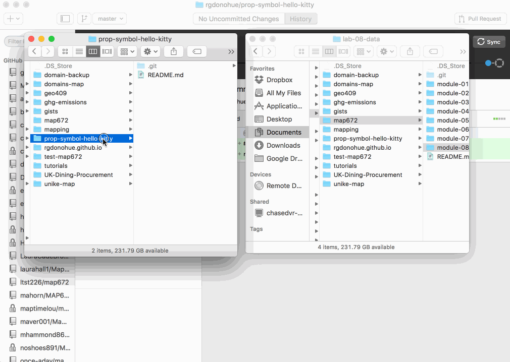
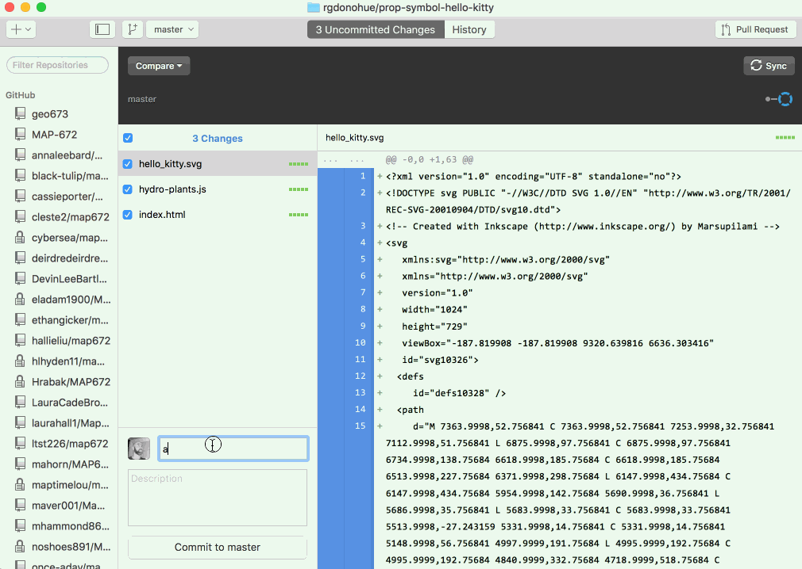

# Lab 01: Serving web maps from GitHub repositories

For this lab, complete your online portfolio by including **at least two** web maps from map672. You'll want to:

* create a new GitHub repository for each web map
* add, commit, and sync the web map *index.html* and associated files to this remote repository
* enable each repository's master branch to be served as GitHub Pages
* link the URL addresses to these web maps from your web portfolio page

The following instructions will guide you through that process.

As we saw in the lesson, creating a repository with our GitHub username and *.gitihub.io* enables GitHub's servers to deliver files within that repository directory as HTTP requests. The GitHub repository ending in *.gitihub.io* is a special repository enabled to do this. In other words, GitHub Pages "serves" our HTML/CSS/JavaScript as a web page rather than merely a collection of text-based files.

However, we can enable this functionality for other GitHub repositories as well. In particular, we want to serve our web maps for our users.

Let's walk through an example. You should locate your solution for map672 Lab 08 on your local file system to use.

Let's say for Lab 08 I created a [Proportional Symbol Map of Hydro Power](http://bl.ocks.org/rgdonohue/80ef203479b5f65db8e5) using some silly Hello Kitty icons as the symbols. Again, the *index.html* and associated data files may be buried within my course repository at *map672-module-08/lab-08/* . I'll want to copy the contents of the *lab-08/* directory over to the new repository at the local level. But first, I need to create this new repository in GitHub and clone that down to our machine.

Login to your GitHub account in the browser. Create a new repository using the small plus dropdown at upper right. Give your new repository a descriptive name (no spaces!). You can add an optional description. Importantly, check the "Initialize this repository with a README" option. This will help you clone your repo down easily.

  
**Figure 01.** Creating a new repository in GitHub.

After you've created this new repository (currently empty, other than the the README.md file automatically created by GitHub), you're ready to clone it down to your machine. You do this in the same way as you cloned the NewMapsPlus course repo and your own MAP672 repo to your local machine (refer to MAP672 Lesson 01).

Clone your new repository down and save it to your local machine. For general organization, you'll likely want to clone it into the same directory as your other GitHub repositories. Do NOT clone in inside your *map673-module-01* repo directory, nor your *username.github.io* repo directory.

Most of us are working in the GitHub Desktop client application. This process will look like this:

  
**Figure 02.** Creating a new repository in GitHub.

After that is complete, we can go into our file/directory structure on our local system, examine our new repository directory, and then **copy the contents** of our working web application/map (including any necessary data and asset files) from the *map672-module-08-username/lab-08/* directory into the new repository's directory.

**Caution**: Copy the **contents of** the *lab-08/* directory, not the entire directory itself. In other words, your file system should NOT be */us-renewable-energy/lab-08/index.html*, but rather */us-renewable-energy/index.html*. The key is to ensure the `index.html` file for your web application/map is at the root of your new repo directory.

  
**Figure 03.** Creating a new repository in GitHub.

Once we do this, we can check the Git status of our repository in GitHub Desktop to verify there are new uncommitted changes to our repository. We can go ahead and commit these, and sync up with our remove repository to verify.

  
**Figure 04.** Creating a new repository in GitHub.

Within the web browser, refresh the GitHub repository to see we've added the new files to the repository and pushed them to the remote.

To do serve our map as rendered pages from the new repository, we'll use a technique known as [Simpler GitHub Pages publishing](https://github.com/blog/2228-simpler-github-pages-publishing) (again, we did this in Module 01 of MAP672). Go into the settings of your new repository and enable your master branch as the source for building GitHub Pages from that repository.

Now you can navigate your web browser to a URL address such as `https://username.github.io/us-renewable-energy/`. If all is working correctly, you should be seeing your rendered web page and map. Test the remotely-hosted page in your web browser (including all the links!).

### Linking to your web map from your online portfolio

Now that we have our map hosted and viewable by a public audience, we can return to our portfolio page built within the lesson and replace that temporary # symbol with the URL we just navigated to (e.g., *rgdonohue.github.io/prop-symbol-hello-kitty/*). Update your *index.html* file within your *username.github.io* directory with your URL, commit these changes to that repo and sync with the remote to verify the links work. Again, using the `target="_blank"` attribute will open your map in a new page, without leaving your portfolio page.

Please submit a completed online portfolio page that includes information about and links to 3 &ndash; 5 maps (two must be web maps from map672) by the due date. Remember to ask for clarification and post questions to the Discussion Board.
